# Cẩm Nang Chuyên Sâu Mạng Máy Tính & Web Protocols (Network & Web Protocols Deep Dive)

> **Tài liệu tham khảo kỹ thuật chuyên sâu dành cho Software Engineer / DevOps / Solution Architect**
> *Phong cách biên soạn: Chuẩn mực, chuyên sâu, trực quan hóa với sơ đồ Mermaid, bóc tách header từng bit và phân tích gói tin Wireshark.*

---

## 📑 Mục Lục
1. [Phân Tích Chuyên Sâu: TCP vs UDP](#1-phân-tích-chuyên-sâu-tcp-vs-udp)
   - [1.1 Cấu trúc Header TCP & UDP](#11-cấu-trúc-header-tcp--udp)
   - [1.2 Phân tích chi tiết các TCP Flags](#12-phân-tích-chi-tiết-các-tcp-flags)
   - [1.3 Cơ chế hoạt động của Sequence Number & Acknowledgment Number](#13-cơ-chế-hoạt-động-của-sequence-number--acknowledgment-number)
   - [1.4 Quá trình Thiết lập (3-Way Handshake) & Giải phóng (4-Way Handshake)](#14-quá-trình-thiết-lập-3-way-handshake--giải-phóng-4-way-handshake)
   - [1.5 Điều khiển Luồng (Flow Control) & Điều khiển Tắc nghẽn (Congestion Control)](#15-điều-khiển-luồng-flow-control--điều-khiển-tắc-nghẽn-congestion-control)
   - [1.6 Bảng so sánh tổng quan & Use Cases: Khi nào dùng và không dùng](#16-bảng-so-sánh-tổng-quan--use-cases-khi-nào-dùng-và-không-dùng)
2. [Quá Trình Phân Giải Tên Miền (DNS Resolution Deep Dive)](#2-quá-trình-phân-giải-tên-miền-dns-resolution-deep-dive)
   - [2.1 Cây phân cấp DNS (DNS Hierarchy)](#21-cây-phân-cấp-dns-dns-hierarchy)
   - [2.2 Phân biệt Recursive Query vs Iterative Query](#22-phân-biệt-recursive-query-vs-iterative-query)
   - [2.3 Chi tiết 8 bước phân giải DNS từng chặng](#23-chi-tiết-8-bước-phân-giải-dns-từng-chặng)
   - [2.4 Các loại DNS Record phổ biến & Cơ chế Caching (TTL)](#24-các-loại-dns-record-phổ-biến--cơ-chế-caching-ttl)
3. [Vòng Đời Hoàn Chỉnh Của Một HTTP Request (Client to Server)](#3-vòng-đời-hoàn-chỉnh-của-một-http-request-client-to-server)
   - [3.1 Mô hình bức tranh toàn cảnh (End-to-End Architecture)](#31-mô-hình-bức-tranh-toàn-cảnh-end-to-end-architecture)
   - [3.2 Chi tiết 10 giai đoạn từ URL đến Render giao diện](#32-chi-tiết-10-giai-đoạn-từ-url-đến-render-giao-diện)
   - [3.3 Bóc tách gói tin qua các tầng mô hình TCP/IP (Encapsulation)](#33-bóc-tách-gói-tin-qua-các-tầng-mô-hình-tcpip-encapsulation)
4. [Bảo Mật Tầng Giao Vận: Quá Trình TLS Handshake (HTTPS)](#4-bảo-mật-tầng-giao-vận-quá-trình-tls-handshake-https)
   - [4.1 Nền tảng mật mã học: Đối xứng, Bất đối xứng và PKI / Digital Certificate](#41-nền-tảng-mật-mã-học-đối-xứng-bất-đối-xứng-và-pki--digital-certificate)
   - [4.2 TLS 1.2 Handshake: 2-RTT Chi tiết từng bản tin](#42-tls-12-handshake-2-rtt-chi-tiết-từng-bản-tin)
   - [4.3 TLS 1.3 Handshake: 1-RTT / 0-RTT & Bước nhảy vọt hiệu năng](#43-tls-13-handshake-1-rtt--0-rtt--bước-nhảy-vọt-hiệu-năng)
5. [Tiến Hóa Của Giao Thức Web: So Sánh HTTP/1.0, HTTP/1.1 và HTTP/2](#5-tiến-hóa-của-giao-thức-web-so-sánh-http10-http11-và-http2)
   - [5.1 HTTP/1.0: Khởi nguyên & Giới hạn Short-lived Connection](#51-http10-khởi-nguyên--giới-hạn-short-lived-connection)
   - [5.2 HTTP/1.1: Persistent Connection, Pipelining & Head-of-Line Blocking](#52-http11-persistent-connection-pipelining--head-of-line-blocking)
   - [5.3 HTTP/2: Binary Framing, Multiplexing, HPACK & Server Push](#53-http2-binary-framing-multiplexing-hpack--server-push)
   - [5.4 Sơ đồ so sánh trực quan cơ chế truyền tải dữ liệu](#54-sơ-đồ-so-sánh-trực-quan-cơ-chế-truyền-tải-dữ-liệu)
   - [5.5 Nhìn nhanh về HTTP/3 (QUIC) & Bảng so sánh tổng hợp](#55-nhìn-nhanh-về-http3-quic--bảng-so-sánh-tổng-hợp)
6. [Cẩm Nang Bắt Và Phân Tích Gói Tin Bằng Wireshark](#6-cẩm-nang-bắt-và-phân-tích-gói-tin-bằng-wireshark)
   - [6.1 Danh sách Wireshark Display Filters thông dụng](#61-danh-sách-wireshark-display-filters-thông-dụng)
   - [6.2 Phân tích mẫu một phiên làm việc thực tế trên Wireshark](#62-phân-tích-mẫu-một-phiên-làm-việc-thực-tế-trên-wireshark)

---

# 1. Phân Tích Chuyên Sâu: TCP vs UDP

Cả **TCP (Transmission Control Protocol - RFC 793)** và **UDP (User Datagram Protocol - RFC 768)** đều là giao thức cốt lõi hoạt động tại **Transport Layer (Tầng 4 trong mô hình OSI)**. Nhiệm vụ chính của tầng này là cung cấp cơ chế giao tiếp End-to-End giữa các tiến trình (Process-to-Process) chạy trên các máy chủ khác nhau thông qua **Port Numbers**.

Tuy nhiên, triết lý thiết kế của hai giao thức này hoàn toàn trái ngược nhau:
* **TCP:** Ưu tiên **độ tin cậy tuyệt đối (Reliability)**, đảm bảo toàn vẹn dữ liệu, đúng thứ tự, kiểm soát tốc độ truyền để tránh nghẽn mạng.
* **UDP:** Ưu tiên **tốc độ tối đa và độ trễ tối thiểu (Low Latency)**, thiết kế dạng "Best-effort" (gửi và quên - Fire and Forget), không thiết lập kết nối trước, không bảo đảm dữ liệu có tới đích hay không.

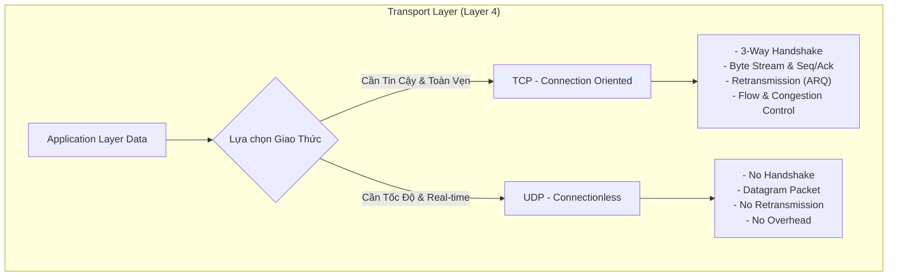

---

## 1.1 Cấu trúc Header TCP & UDP

### Header TCP (Kích thước từ 20 đến 60 Bytes)

Header TCP có kích thước tối thiểu **20 bytes** (khi không có Options) và tối đa **60 bytes** (khi trường Options đạt cực đại 40 bytes).

```text
 0                   1                   2                   3
 0 1 2 3 4 5 6 7 8 9 0 1 2 3 4 5 6 7 8 9 0 1 2 3 4 5 6 7 8 9 0 1
+-+-+-+-+-+-+-+-+-+-+-+-+-+-+-+-+-+-+-+-+-+-+-+-+-+-+-+-+-+-+-+-+
|          Source Port          |       Destination Port        | (4 bytes)
+-+-+-+-+-+-+-+-+-+-+-+-+-+-+-+-+-+-+-+-+-+-+-+-+-+-+-+-+-+-+-+-+
|                        Sequence Number                        | (4 bytes)
+-+-+-+-+-+-+-+-+-+-+-+-+-+-+-+-+-+-+-+-+-+-+-+-+-+-+-+-+-+-+-+-+
|                    Acknowledgment Number                      | (4 bytes)
+-+-+-+-+-+-+-+-+-+-+-+-+-+-+-+-+-+-+-+-+-+-+-+-+-+-+-+-+-+-+-+-+
|  Data |           |U|A|P|R|S|F|                               |
| Offset| Reserved  |R|C|S|S|Y|I|            Window             | (4 bytes)
| (4bit)|  (6 bit)  |G|K|H|T|N|N|                               |
+-+-+-+-+-+-+-+-+-+-+-+-+-+-+-+-+-+-+-+-+-+-+-+-+-+-+-+-+-+-+-+-+
|           Checksum            |        Urgent Pointer         | (4 bytes)
+-+-+-+-+-+-+-+-+-+-+-+-+-+-+-+-+-+-+-+-+-+-+-+-+-+-+-+-+-+-+-+-+
|                    Options (0 to 40 bytes)                    |
+-+-+-+-+-+-+-+-+-+-+-+-+-+-+-+-+-+-+-+-+-+-+-+-+-+-+-+-+-+-+-+-+
|                             Data                              |
+-+-+-+-+-+-+-+-+-+-+-+-+-+-+-+-+-+-+-+-+-+-+-+-+-+-+-+-+-+-+-+-+
```

* **Source Port (16 bits) & Destination Port (16 bits):** Định danh tiến trình gửi và nhận (ví dụ: Port 443 cho HTTPS, Port 80 cho HTTP, Port ngẫu nhiên từ 49152–65535 cho Client).
* **Sequence Number (32 bits):** Đánh dấu chỉ số thứ tự của byte dữ liệu đầu tiên trong Segment này. Nếu cờ `SYN` được bật, đây là **ISN (Initial Sequence Number)**.
* **Acknowledgment Number (32 bits):** Nếu cờ `ACK` được bật, giá trị này chỉ rõ **Sequence Number của byte tiếp theo mà bên nhận đang kỳ vọng nhận được** (Next Expected Byte).
* **Data Offset / Header Length (4 bits):** Cho biết độ dài của TCP Header tính theo đơn vị từ 32-bit (4 bytes). Giá trị nhỏ nhất là `5` (tương đương \(5 \times 4 = 20\) bytes) và lớn nhất là `15` (\(15 \times 4 = 60\) bytes).
* **Reserved (6 bits / 3 bits trên chuẩn mới):** Dành cho mở rộng tương lai (bao gồm cả các cờ ECN như `ECE`, `CWR`, `NS`).
* **Control Flags (9 bits):** Các cờ điều khiển trạng thái kết nối.
* **Window Size (16 bits):** Kích thước Receive Window (`rwnd`) của bên gửi gói tin, thông báo cho bên đối diện biết buffer còn trống bao nhiêu byte để điều khiển luồng (Flow Control).
* **Checksum (16 bits):** Kiểm tra tính toàn vẹn của Header, Payload và TCP Pseudo-Header (chứa IP nguồn/đích).
* **Urgent Pointer (16 bits):** Con trỏ chỉ tới vị trí kết thúc của dữ liệu khẩn cấp nếu cờ `URG` được bật.
* **Options (0 - 40 bytes):** Các tham số mở rộng quan trọng:
  * **MSS (Maximum Segment Size):** Kích thước payload lớn nhất có thể nhận (thường là 1460 bytes trên mạng Ethernet chuẩn MTU 1500).
  * **Window Scale (RFC 7323):** Hệ số nhân dịch bit cho phép mở rộng `Window Size` vượt quá giới hạn 64KB (lên tới 1GB).
  * **SACK Permitted (Selective ACK - RFC 2018):** Cho phép báo nhận từng đoạn không liên tục.
  * **Timestamps:** Đo lường Round Trip Time (RTT) chính xác và chống trùng lặp Sequence Number (PAWS).

---

### Header UDP (Kích thước cố định 8 Bytes)

Header UDP cực kỳ tối giản, chỉ vỏn vẹn **8 bytes** (nhẹ hơn TCP Header tới 2.5 - 7.5 lần):

```text
 0                   1                   2                   3
 0 1 2 3 4 5 6 7 8 9 0 1 2 3 4 5 6 7 8 9 0 1 2 3 4 5 6 7 8 9 0 1
+-+-+-+-+-+-+-+-+-+-+-+-+-+-+-+-+-+-+-+-+-+-+-+-+-+-+-+-+-+-+-+-+
|          Source Port          |       Destination Port        | (4 bytes)
+-+-+-+-+-+-+-+-+-+-+-+-+-+-+-+-+-+-+-+-+-+-+-+-+-+-+-+-+-+-+-+-+
|            Length             |           Checksum            | (4 bytes)
+-+-+-+-+-+-+-+-+-+-+-+-+-+-+-+-+-+-+-+-+-+-+-+-+-+-+-+-+-+-+-+-+
|                             Data                              |
+-+-+-+-+-+-+-+-+-+-+-+-+-+-+-+-+-+-+-+-+-+-+-+-+-+-+-+-+-+-+-+-+
```

* **Source Port (16 bits) & Destination Port (16 bits):** Cổng nguồn và cổng đích.
* **Length (16 bits):** Tổng độ dài của UDP Header + UDP Data tính bằng Byte (Tối thiểu là `8`).
* **Checksum (16 bits):** Kiểm tra lỗi bit. Trong IPv4 trường này là tùy chọn (optional, đặt bằng `0` nếu không dùng), nhưng trong IPv6 bắt buộc phải có.

---

## 1.2 Phân tích chi tiết các TCP Flags

Các cờ (Flags) là các bit nhị phân (0 hoặc 1) quyết định mục đích và ngữ nghĩa của TCP Segment:

| Flag | Tên đầy đủ | Ý nghĩa & Cơ chế hoạt động sâu |
| :--- | :--- | :--- |
| **SYN** | *Synchronize* | Khởi tạo kết nối TCP. Gói tin có `SYN=1` dùng để đồng bộ Sequence Number ban đầu (ISN). Không mang payload ứng dụng nhưng tiêu tốn 1 đơn vị Sequence Number. |
| **ACK** | *Acknowledgment* | Xác nhận đã nhận được dữ liệu. Khi `ACK=1`, trường `Acknowledgment Number` có hiệu lực. Trong mọi gói tin TCP sau bước handshake đầu tiên, bit `ACK` luôn luôn được bật (`ACK=1`). |
| **FIN** | *Finish* | Yêu cầu đóng kết nối một cách êm đẹp (Graceful Teardown). Bên gửi thông báo rằng họ đã gửi xong toàn bộ dữ liệu và sẽ không truyền thêm byte nào nữa (nhưng vẫn có thể nhận dữ liệu). Tiêu tốn 1 Sequence Number. |
| **RST** | *Reset* | Buộc đóng kết nối ngay lập tức (Abrupt Termination) mà không cần qua quy trình bắt tay 4 bước. Thường xuất hiện khi: kết nối gửi tới cổng không mở (Port Closed), kết nối bị crash, vi phạm giao thức, hoặc can thiệp từ Firewall/Security appliance. |
| **PSH** | *Push* | Yêu cầu TCP Receiver đẩy ngay lập tức toàn bộ dữ liệu trong Receive Buffer lên Application Layer mà không cần chờ buffer đầy. Thường dùng trong các ứng dụng tương tác như SSH, Telnet, hoặc bản tin HTTP request cuối cùng. |
| **URG** | *Urgent* | Báo hiệu gói tin chứa dữ liệu khẩn cấp. Vị trí byte khẩn cấp được xác định bởi trường `Urgent Pointer`. Dữ liệu này được xử lý ưu tiên vượt qua hàng đợi thông thường (Ví dụ: tín hiệu `Ctrl + C` ngắt lệnh trong phiên Telnet/SSH). |
| **ECE** | *ECN-Echo* | Báo hiệu có nghẽn mạng xảy ra từ router hỗ trợ ECN (Explicit Congestion Notification). |
| **CWR** | *Congestion Window Reduced* | Bên gửi xác nhận đã nhận được cờ `ECE` và đã chủ động giảm kích thước cửa sổ nghẽn (`cwnd`). |

---

## 1.3 Cơ chế hoạt động của Sequence Number & Acknowledgment Number

TCP là một **Byte-Stream Protocol** (Giao thức truyền luồng byte), nghĩa là TCP coi dữ liệu như một dòng chảy liên tục của các byte chứ không phải các gói tin độc lập.

```text
Dữ liệu ứng dụng: [ Byte 0 | Byte 1 | Byte 2 | ... | Byte 9999 ]
TCP Segment 1:     [ Byte 0 -> Byte 1459 ]     --> Seq = 0, Length = 1460
TCP Segment 2:     [ Byte 1460 -> Byte 2919 ]  --> Seq = 1460, Length = 1460
```

### 1. Initial Sequence Number (ISN)
Khi thiết lập kết nối, Sequence Number không bắt đầu từ số 0 cố định mà được tạo ngẫu nhiên theo thuật toán dựa trên đồng hồ hệ thống và hàm băm mật mã (RFC 6528) nhằm ngăn chặn tấn công **TCP Sequence Prediction / TCP Spoofing**.

### 2. Công thức tính Sequence Number & Acknowledgment Number
* **Sequence Number của bên gửi ($Seq_{send}$):** Là chỉ số của byte đầu tiên nằm trong Payload của Segment đó.
$$\text{Seq}_{\text{next}} = \text{Seq}_{\text{current}} + \text{Payload Length} \quad (\text{hoặc } +1 \text{ nếu gói có cờ SYN hoặc FIN})$$
* **Acknowledgment Number của bên nhận ($Ack_{recv}$):** Luôn là **Cumulative ACK** (Báo nhận lũy kế), mang ý nghĩa: *"Tôi đã nhận thành công toàn bộ các byte trước đó, byte tiếp theo tôi đang đợi là $Ack_{recv}$"*.
$$\text{Ack}_{\text{return}} = \text{Seq}_{\text{received}} + \text{Payload Length}$$

### Ví dụ truyền dữ liệu thực tế:
1. **Client -> Server:** Gửi `Seq = 1001`, mang `Payload = 500 bytes` (chứa các byte từ 1001 đến 1500).
2. **Server nhận đủ 500 bytes:** Server phản hồi lại với `Ack = 1501` (chỉ ra rằng byte 1501 là byte Server đang mong đợi kế tiếp).
3. Nếu gói tin bị mất trên đường truyền: Server sẽ không gửi `Ack = 1501`. Client sau một khoảng thời gian **RTO (Retransmission Timeout)** không nhận được ACK sẽ tự động gửi lại Segment bắt đầu từ `Seq = 1001`.

---

## 1.4 Quá trình Thiết lập (3-Way Handshake) & Giải phóng (4-Way Handshake)

### 3-Way Handshake (Bắt tay 3 bước)

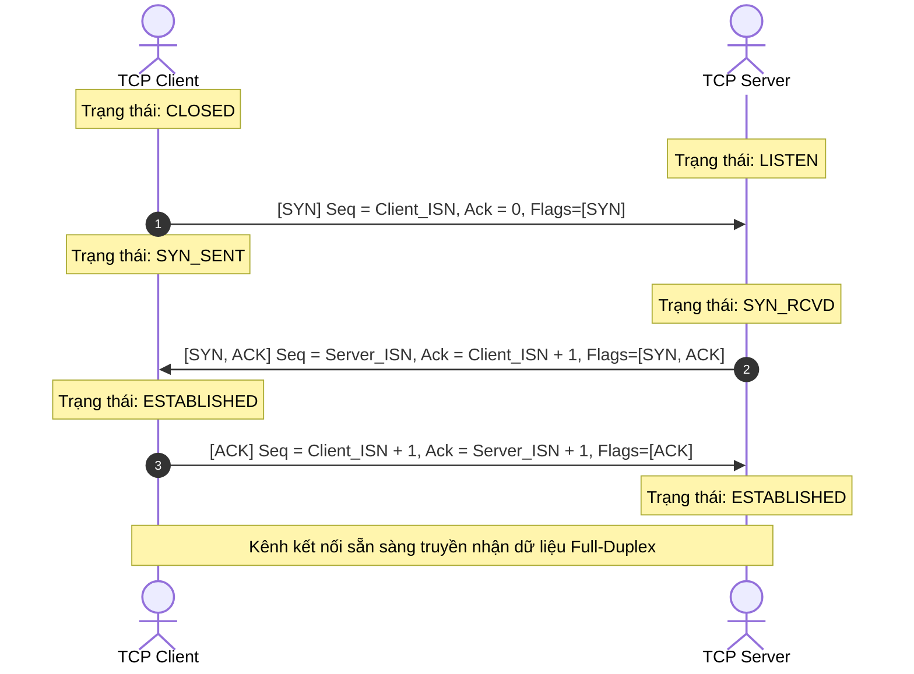

* **Bước 1 (SYN):** Client chọn một `Client_ISN` ngẫu nhiên (ví dụ `1000`) và gửi gói tin `SYN=1`. Client chuyển sang trạng thái `SYN_SENT`.
* **Bước 2 (SYN-ACK):** Server nhận được, cấp phát bộ đệm (Transmission Control Block - TCB), chọn `Server_ISN` (ví dụ `5000`), đặt `Ack = 1000 + 1 = 1001`, bật `SYN=1, ACK=1`. Server chuyển sang trạng thái `SYN_RCVD`.
* **Bước 3 (ACK):** Client nhận được `SYN-ACK`, xác nhận với `Ack = 5000 + 1 = 5001`, `Seq = 1001`, bật `ACK=1`. Lúc này kết nối chính thức đạt trạng thái `ESTABLISHED` ở cả 2 đầu.

---

### 4-Way Handshake (Giải phóng kết nối 4 bước)

Vì TCP là kênh truyền song công toàn phần (**Full-Duplex**), mỗi chiều truyền nhận dữ liệu phải được đóng độc lập:

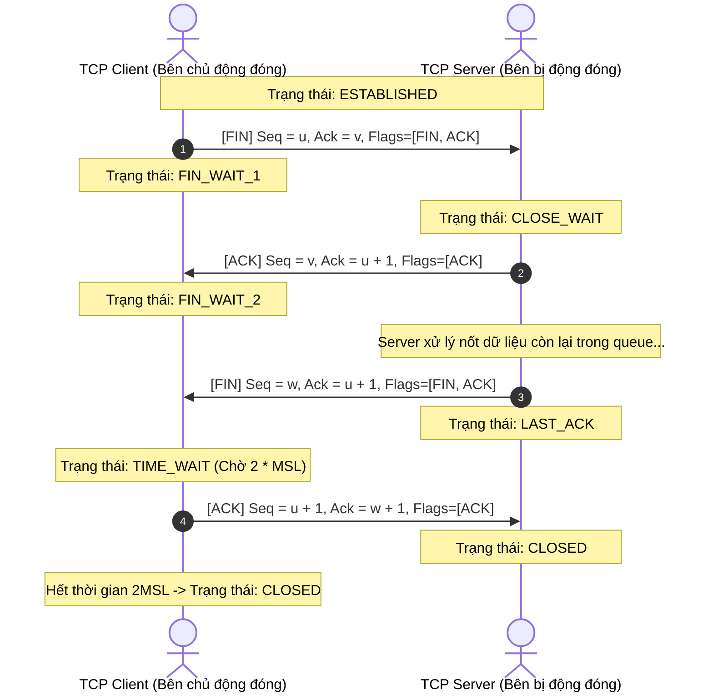

> [!IMPORTANT]
> **Tại sao cần trạng thái TIME_WAIT (kéo dài \(2 \times \text{MSL}\) thường là 60s - 120s)?**
> 1. **Đảm bảo ACK cuối cùng tới được Server:** Nếu gói `ACK` ở bước 4 bị thất lạc, Server sẽ gửi lại gói `FIN` (bước 3). Nếu Client đóng ngay lập tức (`CLOSED`), Client sẽ gửi lại gói `RST` khi nhận được `FIN` tái truyền, khiến Server lầm tưởng kết nối bị lỗi thay vì đóng thành công.
> 2. **Dọn sạch các gói tin trôi nổi trên mạng (Old Duplicate Segments):** Tránh trường hợp một kết nối mới mở trùng đúng cặp IP/Port cũ nhận nhầm các gói tin còn sót lại từ kết nối trước đó.

---

## 1.5 Điều khiển Luồng (Flow Control) & Điều khiển Tắc nghẽn (Congestion Control)

TCP sở hữu 2 cơ chế kiểm soát tốc độ truyền dữ liệu tinh vi:

```text
                     +-----------------------------------+
                     | Kích thước cửa sổ truyền thực tế  |
                     | W = min(rwnd, cwnd)               |
                     +-----------------+-----------------+
                                       |
            +--------------------------+--------------------------+
            |                                                     |
            v                                                     v
+-----------------------+                             +-----------------------+
|     FLOW CONTROL      |                             |  CONGESTION CONTROL   |
| (Điều khiển luồng)    |                             | (Điều khiển tắc nghẽn)|
| Bảo vệ Receiver Buffer|                             | Bảo vệ Hạ tầng Mạng  |
| Tham số: rwnd         |                             | Tham số: cwnd         |
+-----------------------+                             +-----------------------+
```

### 1. Flow Control (Bảo vệ bên nhận với Sliding Window)
* Được điều khiển bởi **Receive Window (`rwnd`)** do bên nhận gửi về trong TCP Header.
* Nếu ứng dụng bên nhận xử lý dữ liệu chậm, buffer bị đầy, giá trị `rwnd` giảm dần về `0` (**Zero Window**).
* Khi `rwnd = 0`, bên gửi ngừng truyền dữ liệu và định kỳ gửi các gói thăm dò **Zero Window Probe (ZWP)** kích thước 1 byte để kiểm tra xem buffer của bên nhận đã giải phóng chưa.

### 2. Congestion Control (Bảo vệ hạ tầng mạng)
* Được điều khiển bởi **Congestion Window (`cwnd`)** do bên gửi tự tính toán dựa trên phản hồi của mạng.
* Các thuật toán kinh điển (TCP Reno, Tahoe, CUBIC, BBR):
  * **Slow Start (Khởi động chậm):** Bắt đầu với $cwnd = 10 \text{ SMSS}$, tăng gấp đôi $cwnd$ sau mỗi RTT (tăng theo hàm mũ) cho đến khi chạm ngưỡng **ssthresh (Slow Start Threshold)**.
  * **Congestion Avoidance (Tránh tắc nghẽn):** Khi $cwnd \ge ssthresh$, $cwnd$ chỉ tăng tuyến tính \(+1 \text{ MSS}\) sau mỗi RTT (Additive Increase).
  * **Fast Retransmit & Fast Recovery:** Khi nhận được **3 Duplicate ACKs** liên tiếp, TCP hiểu rằng chỉ có 1 gói bị mất chứ mạng chưa bị sập hoàn toàn -> Ngay lập tức gửi lại gói bị mất mà không cần chờ Timeout (RTO) và giảm nhẹ $cwnd$ (Multiplicative Decrease) thay vì kéo $cwnd$ về 1.

---

## 1.6 Bảng so sánh tổng quan & Use Cases: Khi nào dùng và không dùng

| Tiêu chí | TCP (Transmission Control Protocol) | UDP (User Datagram Protocol) |
| :--- | :--- | :--- |
| **Bản chất kết nối** | Connection-oriented (Có bắt tay 3 bước) | Connectionless (Không bắt tay) |
| **Độ tin cậy (Reliability)** | Đảm bảo 100% (Có ACK, Retransmission, Checksum) | Không đảm bảo (Có thể mất gói, trùng gói) |
| **Thứ tự dữ liệu (Ordering)** | Đảm bảo nguyên vẹn thứ tự qua Sequence Number | Không đảm bảo (Gói nào tới trước nhận trước) |
| **Overhead Header** | Nặng: 20 – 60 Bytes | Rất nhẹ: Cố định 8 Bytes |
| **Cơ chế truyền** | Byte Stream liên tục | Datagram đóng gói rời rạc (Message-oriented) |
| **Kiểm soát nghẽn & Luồng** | Có đầy đủ (Flow Control & Congestion Control) | Hoàn toàn không có |
| **Head-of-Line Blocking** | Có (ở tầng Transport: mất 1 packet là nghẽn cả luồng) | Không |
| **Kiểu truyền tin** | Unicast (1 - 1) | Unicast, Multicast, Broadcast (1 - Many) |

### 🎯 Khi nào nên dùng TCP?
1. **Toàn vẹn dữ liệu là ưu tiên số 1:** Mất dù chỉ 1 byte cũng gây hỏng dữ liệu hoặc crash hệ thống.
   * *Ví dụ:* Web browsing (HTTP/HTTPS), Chuyển file (FTP, SFTP), Gửi nhận email (SMTP, IMAP, POP3), Cơ sở dữ liệu (PostgreSQL, MySQL connection), SSH / Telnet.
2. **Hệ thống thanh toán / Giao dịch tài chính:** Bắt buộc chuẩn xác, không được mất thông điệp.

### ⚡ Khi nào nên dùng UDP?
1. **Độ trễ thời gian thực (Real-time Latency) quan trọng hơn mất gói nhỏ:** Thà mất vài frame hình/âm thanh còn hơn bị giật lag chờ gửi lại.
   * *Ví dụ:* VoIP (Voice over IP), Video Streaming trực tiếp (RTP/RTSP), Gaming online (truyền tọa độ nhân vật), WebRTC (Voice/Video call).
2. **Giao tiếp truy vấn nhanh dạng Request - Response đơn giản:** Chi phí 3-way handshake của TCP là quá lớn so với payload.
   * *Ví dụ:* DNS Query (Port 53), DHCP (Cấp phát IP động), NTP (Đồng bộ thời gian).
3. **Mạng cục bộ cần Broadcast / Multicast:** Gửi 1 bản tin tới toàn bộ thiết bị trong mạng LAN.
   * *Ví dụ:* Discovery thiết bị trong IoT (mDNS, SSDP).
4. **Tự xây dựng cơ chế tin cậy ở Application Layer (Custom Transport):**
   * *Ví dụ:* Giao thức **QUIC (HTTP/3)** chạy trên UDP nhưng tự hiện thực cơ chế mã hóa và chống mất gói tối ưu hơn TCP!

---

# 2. Quá Trình Phân Giải Tên Miền (DNS Resolution Deep Dive)

DNS (Domain Name System) được ví như "cuốn danh bạ điện thoại của Internet", có nhiệm vụ chuyển đổi tên miền thân thiện với con người (ví dụ: `api.example.com`) thành địa chỉ IP mà máy tính hiểu được (ví dụ: `93.184.216.34` hoặc `2606:2800:220:1:248:1893:25c8:1946`).

---

## 2.1 Cây phân cấp DNS (DNS Hierarchy)

Không có một máy chủ DNS đơn lẻ nào lưu trữ toàn bộ dữ liệu Internet. Thay vào đó, DNS được tổ chức theo cấu trúc cây phân cấp hình nón ngược:

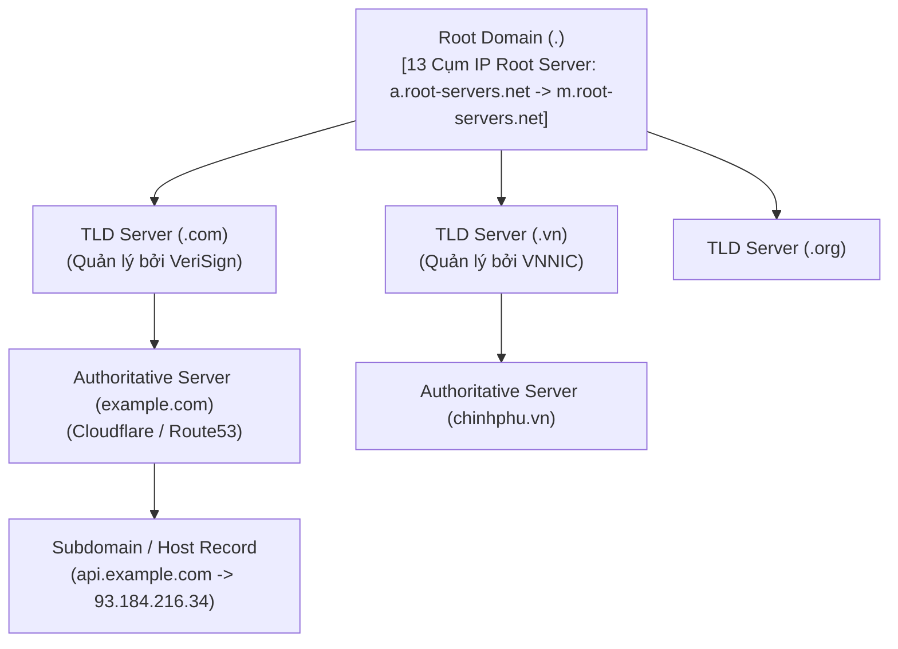

1. **Root Name Server (`.`):** Gốc của toàn bộ không gian tên miền. Có 13 địa chỉ IP máy chủ gốc logic (từ `a.root-servers.net` đến `m.root-servers.net`), được phân tán trên hàng ngàn máy chủ vật lý toàn cầu thông qua công nghệ Anycast.
2. **Top-Level Domain (TLD) Name Server:** Quản lý phần đuôi tên miền như Generic TLD (`.com`, `.net`, `.org`) hoặc Country-code TLD (`.vn`, `.jp`, `.uk`).
3. **Authoritative Name Server:** Máy chủ chứa dữ liệu gốc có thẩm quyền cuối cùng cho một tên miền cụ thể (ví dụ: DNS của Cloudflare, AWS Route 53, Namecheap).

---

## 2.2 Phân biệt Recursive Query vs Iterative Query

* **Recursive Query (Truy vấn đệ quy):** Client giao phó toàn bộ trách nhiệm cho DNS Resolver: *"Hãy tìm địa chỉ IP chính xác cho tôi, tôi chỉ nhận kết quả cuối cùng hoặc thông báo lỗi!"*.
* **Iterative Query (Truy vấn lặp):** DNS Resolver tự mình đi hỏi từng cấp máy chủ: *"Nếu bạn không biết IP này, hãy chỉ cho tôi biết máy chủ tiếp theo tôi cần hỏi là ai"*.

---

## 2.3 Chi tiết 8 bước phân giải DNS từng chặng

Giả sử người dùng nhập `https://api.example.com` vào trình duyệt lần đầu tiên:

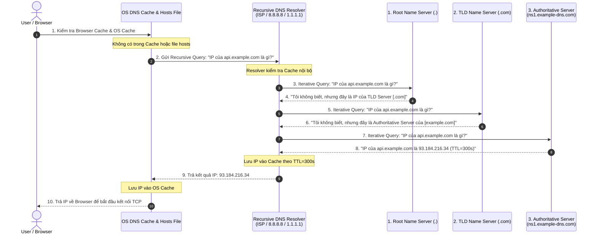

### Bóc tách chi tiết từng bước:
1. **Kiểm tra Bộ nhớ đệm cục bộ (Local Cache Lookup):**
   * **Browser Cache:** Trình duyệt kiểm tra cache nội bộ (ví dụ trên Chrome xem tại `chrome://net-internals/#dns`).
   * **OS Cache:** Nếu trình duyệt không có, gọi System Call `getaddrinfo` của Hệ điều hành. OS kiểm tra DNS Client Cache (`ipconfig /displaydns` trên Windows).
   * **Local Hosts File:** OS đọc file cấu hình tĩnh (`/etc/hosts` trên Linux/macOS hoặc `C:\Windows\System32\drivers\etc\hosts` trên Windows).
2. **Gửi truy vấn tới Recursive DNS Resolver:**
   * Thường là địa chỉ IP của Router mạng LAN, DNS của nhà mạng ISP, hoặc Public DNS do người dùng cài đặt (`8.8.8.8` của Google, `1.1.1.1` của Cloudflare).
   * Resolver kiểm tra cache của chính nó. Nếu còn hạn TTL, trả về ngay lập tức.
3. **Truy vấn Root Server:**
   * Nếu cache rỗng, Resolver gửi gói tin UDP Port 53 tới một trong các Root Servers để hỏi về `api.example.com`.
4. **Phản hồi từ Root Server:**
   * Root Server phản hồi danh sách địa chỉ NS (Name Server) của TLD `.com`.
5. **Truy vấn TLD Server (.com):**
   * Resolver gửi truy vấn tiếp tới máy chủ quản lý `.com`.
6. **Phản hồi từ TLD Server:**
   * TLD Server phản hồi danh sách máy chủ Authoritative của domain `example.com` (kèm bản ghi Glue Records - IP của Authoritative Server).
7. **Truy vấn Authoritative Name Server:**
   * Resolver truy vấn trực tiếp Authoritative Server quản lý `example.com`.
8. **Phản hồi IP cuối cùng:**
   * Authoritative Server tìm trong cơ sở dữ liệu vùng (Zone File) và trả về bản ghi `A Record: 93.184.216.34` kèm thời gian sống `TTL (Time to Live)`.
9. **Lưu Cache & Hoàn tất:**
   * Resolver lưu cache, trả kết quả về OS, OS lưu cache và trả về cho Browser.

---

## 2.4 Các loại DNS Record phổ biến & Cơ chế Caching (TTL)

* **A Record (Address):** Trỏ tên miền sang địa chỉ IPv4 (ví dụ: `93.184.216.34`).
* **AAAA Record:** Trỏ tên miền sang địa chỉ IPv6 (128-bit).
* **CNAME Record (Canonical Name):** Bí danh trỏ một tên miền sang một tên miền khác (ví dụ: `www.example.com -> example.com`). *Lưu ý: CNAME không thể đặt tại Apex/Root domain (`@`)*.
* **MX Record (Mail Exchange):** Chỉ định máy chủ nhận email cho tên miền.
* **TXT Record:** Lưu trữ chuỗi văn bản tự do, ứng dụng phổ biến trong xác thực bảo mật email (SPF, DKIM, DMARC) hoặc xác minh sở hữu domain.
* **NS Record (Name Server):** Khai báo máy chủ nào có quyền quản lý DNS cho domain.
* **SOA Record (Start of Authority):** Chứa thông tin quản trị cốt lõi của Zone (Primary Master, Admin Email, Serial number, Refresh/Retry intervals).
* **TTL (Time to Live):** Đơn vị tính bằng Giây (seconds). Xác định thời gian tối đa mà các trung gian (Resolver, Browser, Gateway) được phép cache bản ghi trước khi buộc phải truy vấn lại.

---

# 3. Vòng Đời Hoàn Chỉnh Của Một HTTP Request (Client to Server)

Khi một kỹ sư gõ `https://api.example.com/v1/users` vào thanh địa chỉ trình duyệt và nhấn Enter, hàng loạt tiến trình phức tạp diễn ra xuyên suốt từ Application Layer xuống tận Physical Layer.

---

## 3.1 Mô hình bức tranh toàn cảnh (End-to-End Architecture)

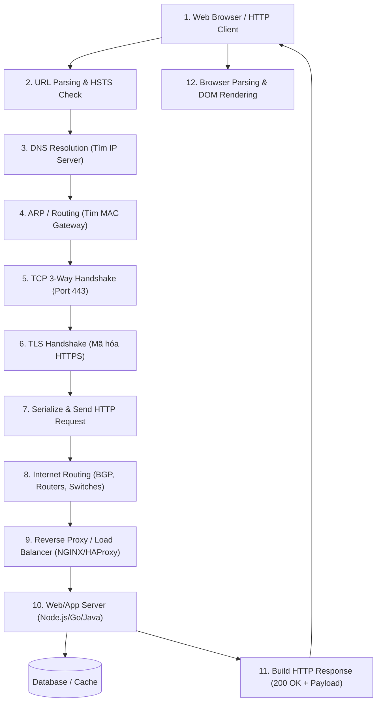

---

## 3.2 Chi tiết 10 giai đoạn từ URL đến Render giao diện

### Giai đoạn 1: URL Parsing & Kiểm tra HSTS
* Trình duyệt phân tách URL thành các thành phần:
  * **Scheme:** `https` (suy ra mặc định port `443`).
  * **Host:** `api.example.com`.
  * **Path:** `/v1/users`.
* **HSTS Check (HTTP Strict Transport Security):** Trình duyệt kiểm tra danh sách nội bộ (HSTS Preload list). Nếu domain yêu cầu HTTPS bắt buộc, trình duyệt sẽ tự động chuyển hướng nội bộ (`307 Internal Redirect`) từ `http://` sang `https://` trước khi phát sinh bất kỳ gói tin nào ra mạng.

### Giai đoạn 2: Phân giải DNS
* Thực hiện toàn bộ quy trình như đã mô tả ở [Mục 2](#2-quá-trình-phân-giải-tên-miền-dns-resolution-deep-dive) để lấy địa chỉ IP đích: `93.184.216.34`.

### Giai đoạn 3: Phân giải tầng liên kết dữ liệu (ARP & Routing)
* Hệ điều hành kiểm tra bảng định tuyến (Routing Table) xem IP đích có cùng mạng cục bộ (Subnet) hay nằm ở ngoài Internet.
* Nếu nằm ngoài Internet: Gói tin cần được chuyển tới **Default Gateway (Router)**.
* OS kiểm tra **Bảng ARP (ARP Table)** để tìm địa chỉ MAC của Router. Nếu chưa có, OS phát một gói tin **ARP Request (Broadcast)**: *"Ai giữ IP 192.168.1.1 hãy cho tôi biết địa chỉ MAC?"*, Router phản hồi **ARP Reply (Unicast)** với địa chỉ MAC của nó.

### Giai đoạn 4: Mở kết nối TCP (3-Way Handshake)
* Client mở một Socket cục bộ (gán Port ngẫu nhiên, ví dụ `52431`) và khởi tạo bắt tay 3 bước với `93.184.216.34:443` (SYN -> SYN-ACK -> ACK).

### Giai đoạn 5: Bắt tay bảo mật TLS Handshake
* Vì sử dụng `https://`, ngay sau khi TCP kết nối thành công, Client và Server tiến hành thương lượng khóa bảo mật qua TLS (xem chi tiết ở [Mục 4](#4-bảo-mật-tầng-giao-vận-quá-trình-tls-handshake-https)).

### Giai đoạn 6: Đóng gói và Gửi HTTP Request
* HTTP Client tạo bản tin văn bản thô (HTTP/1.1) hoặc Frame nhị phân (HTTP/2):
```http
GET /v1/users HTTP/1.1
Host: api.example.com
User-Agent: Mozilla/5.0 (Windows NT 10.0; Win64; x64)
Accept: application/json
Authorization: Bearer eyJhbGciOi...
Connection: keep-alive
```
* Dữ liệu này được mã hóa thông qua TLS Record Layer, chia thành các TCP Segments, gắn IP Header, gắn Ethernet Frame và truyền qua card mạng (NIC).

### Giai đoạn 7: Xử lý tại Phía Máy Chủ (Server Processing)
1. **Edge / Load Balancer / Reverse Proxy (ví dụ NGINX, Cloudflare, AWS ALB):**
   * Tiếp nhận kết nối TCP, giải mã TLS (TLS Termination).
   * Kiểm tra Rate Limiting, WAF (Web Application Firewall).
   * Forward request qua mạng nội bộ tới Application Server (Upstream).
2. **Application Server (Go, Node.js, Spring Boot, Python...):**
   * Middleware: Parse Header, xác thực token JWT/Session, CORS.
   * Controller & Business Logic: Gọi Service, truy vấn CSDL (PostgreSQL, Redis), tổng hợp dữ liệu.
   * Xây dựng HTTP Response Body (JSON/HTML).

### Giai đoạn 8: Máy Chủ Trả HTTP Response
* Server đóng gói HTTP Response:
```http
HTTP/1.1 200 OK
Content-Type: application/json; charset=utf-8
Content-Length: 128
Cache-Control: max-age=3600
Set-Cookie: session_id=xyz789; Secure; HttpOnly; SameSite=Strict

{"status":"success","data":[{"id":1,"name":"Alice"},{"id":2,"name":"Bob"}]}
```
* Dữ liệu được mã hóa TLS và gửi ngược lại về Client qua kết nối TCP đã thiết lập.

### Giai đoạn 9: Client Tiếp Nhận và Xử Lý
* Trình duyệt nhận các gói TCP, sắp xếp lại theo Sequence Number, giải mã qua TLS.
* Đọc `Status Code` (200 OK), đọc Header (`Content-Type`, `Cache-Control`, `Set-Cookie` để lưu cookie an toàn).
* Đọc Body dữ liệu.

### Giai đoạn 10: Quá trình Render (Nếu là Web Browser tải trang HTML)
1. **Parse HTML:** Xây dựng **DOM Tree** (Document Object Model).
2. **Parse CSS:** Xây dựng **CSSOM Tree** (CSS Object Model).
3. **Execute JavaScript:** Tải và thực thi script (có thể làm biến đổi DOM).
4. **Render Tree:** Kết hợp DOM + CSSOM -> Tính toán bố cục tọa độ (**Layout / Reflow**).
5. **Painting & Compositing:** Vẽ từng pixel lên màn hình GPU (**Repaint**).
6. **Fetch Sub-resources:** Tiếp tục kích hoạt các request tải thêm ảnh, font, stylesheet qua cơ chế Connection Reuse (Keep-Alive).

---

## 3.3 Bóc tách gói tin qua các tầng mô hình TCP/IP (Encapsulation)

Quá trình đóng gói dữ liệu (Data Encapsulation) từ trên xuống dưới:

```text
+-------------------------------------------------------------------------+
| [Application Data] (HTTP Request Payload: GET /v1/users...)             |
+-------------------------------------------------------------------------+
                                    |
                                    v (Thêm TLS Record & TCP Header)
+--------------------+----------------------------------------------------+
| TCP Header         | TLS Encrypted Data                                 |
| (Ports, Seq, Ack)  |                                                    |
+--------------------+----------------------------------------------------+
                                    |
                                    v (Thêm IP Header)
+--------------------+--------------------+-------------------------------+
| IP Header          | TCP Header         | TLS Encrypted Data            |
| (Src IP, Dst IP)   |                    |                               |
+--------------------+--------------------+-------------------------------+
                                    |
                                    v (Thêm Ethernet Frame)
+-------------+-------------+-------------+-------------------------------+---------+
| Ethernet    | IP Header   | TCP Header  | TLS Encrypted Data            | FCS/CRC |
| (Src/Dst MAC|             |             |                               | (Trailer|
+-------------+-------------+-------------+-------------------------------+---------+
```

---

# 4. Bảo Mật Tầng Giao Vận: Quá Trình TLS Handshake (HTTPS)

HTTPS không phải là một giao thức mới độc lập, mà là **HTTP chạy trên nền kênh truyền bảo mật TLS/SSL (Transport Layer Security)**.

---

## 4.1 Nền tảng mật mã học: Đối xứng, Bất đối xứng và PKI / Digital Certificate

Để hiểu TLS Handshake, cần nắm vững 3 trụ cột mật mã học:

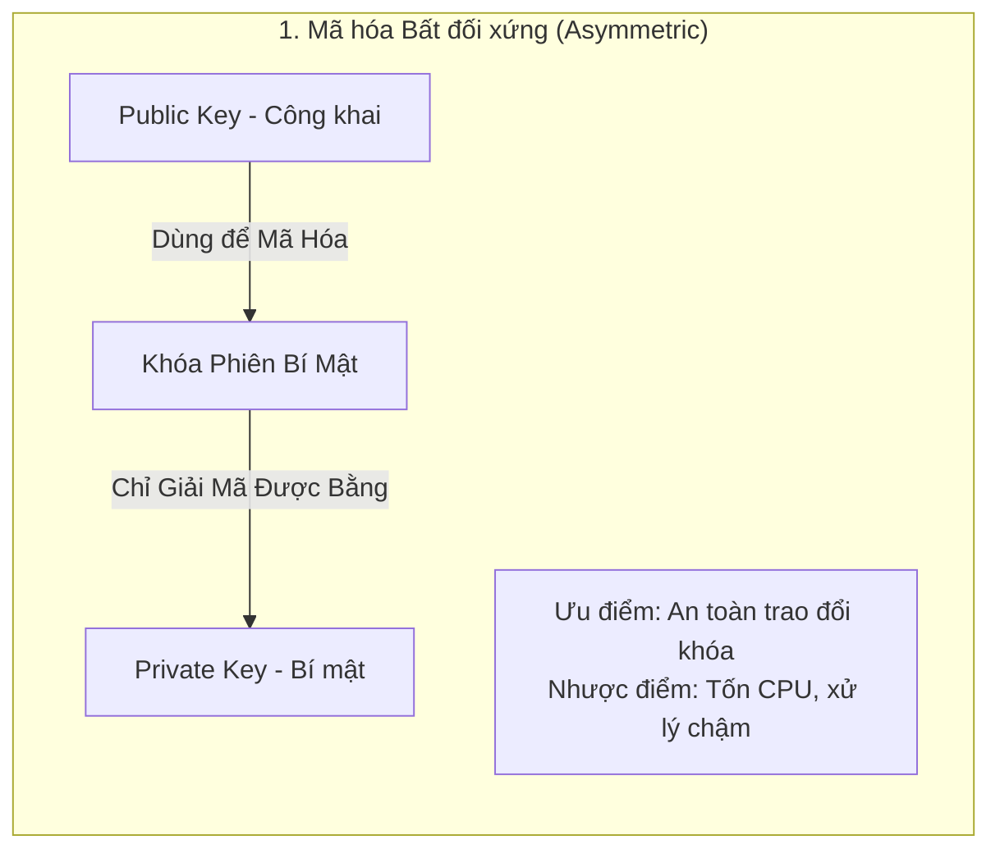

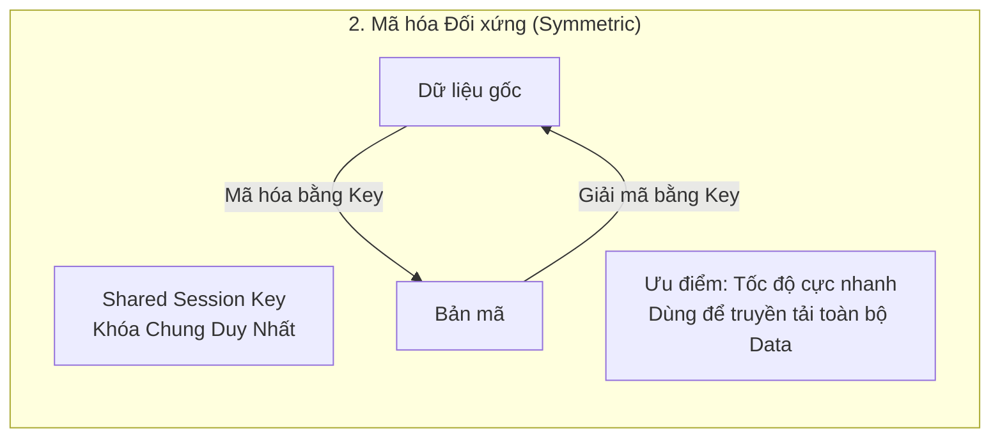

### 3. Public Key Infrastructure (PKI) & Digital Certificate (X.509)
* **Vấn đề:** Làm sao Client biết Public Key nhận được thực sự là của `example.com` chứ không phải của Hacker đang đứng giữa (Man-In-The-Middle - MITM)?
* **Giải pháp:** Sử dụng **Chứng chỉ số (Certificate)** được ký số bởi các **Tổ chức cấp phát chứng chỉ uy tín (Certificate Authority - CA)** như Let's Encrypt, DigiCert, Sectigo.
* **Chuỗi tin cậy (Chain of Trust):**
  $$\text{Root CA (Được cài sẵn trong OS/Browser)} \longrightarrow \text{Intermediate CA} \longrightarrow \text{Server Certificate (Leaf)}$$

---

## 4.2 TLS 1.2 Handshake: 2-RTT Chi tiết từng bản tin

TLS 1.2 (RFC 5246) sử dụng cơ chế bắt tay tiêu tốn **2 RTT (Round-Trip Times)** trước khi dữ liệu ứng dụng đầu tiên được gửi đi:

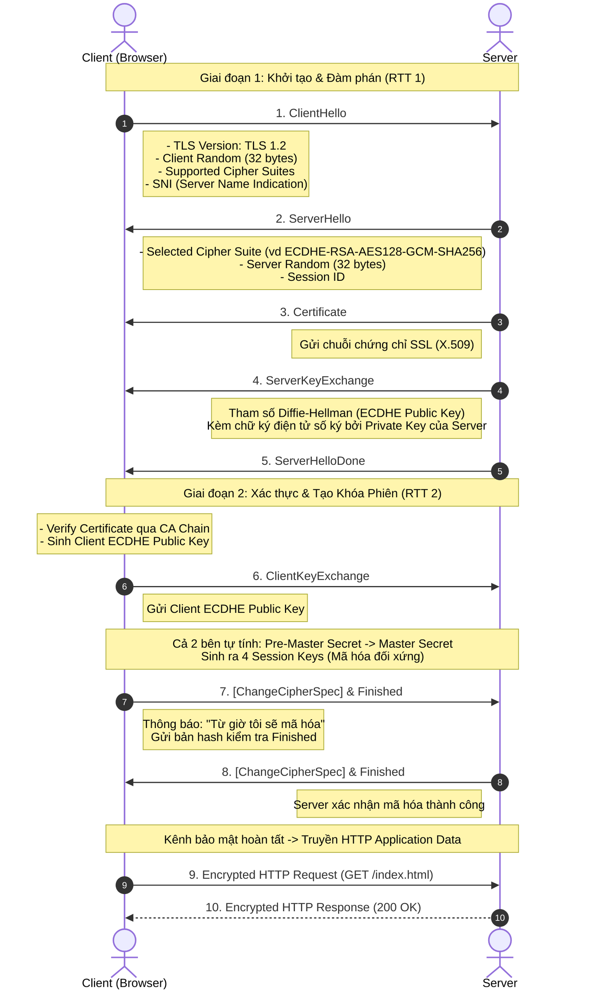

### Công thức dẫn xuất khóa (Key Derivation):
1. Qua thuật toán trao đổi khóa (ECDHE), cả hai bên cùng tính ra được một bí mật chung gọi là **Pre-Master Secret**.
2. Kết hợp với 2 số ngẫu nhiên:
$$\text{Master Secret} = \text{PRF}(\text{Pre-Master Secret}, \text{"master secret"}, \text{Client Random} + \text{Server Random})$$
3. Từ `Master Secret` sinh ra bộ 4 khóa đối xứng:
   * **Client Write Encryption Key:** Mã hóa dữ liệu Client gửi đi.
   * **Server Write Encryption Key:** Mã hóa dữ liệu Server gửi đi.
   * **Client Write IV / MAC Key:** Đảm bảo toàn vẹn dữ liệu từ Client.
   * **Server Write IV / MAC Key:** Đảm bảo toàn vẹn dữ liệu từ Server.

---

## 4.3 TLS 1.3 Handshake: 1-RTT / 0-RTT & Bước nhảy vọt hiệu năng

TLS 1.3 (RFC 8446 ra mắt năm 2018) tái cấu trúc toàn diện để đạt 2 mục tiêu: **Bảo mật tối đa** và **Tối ưu tốc độ vượt trội**:

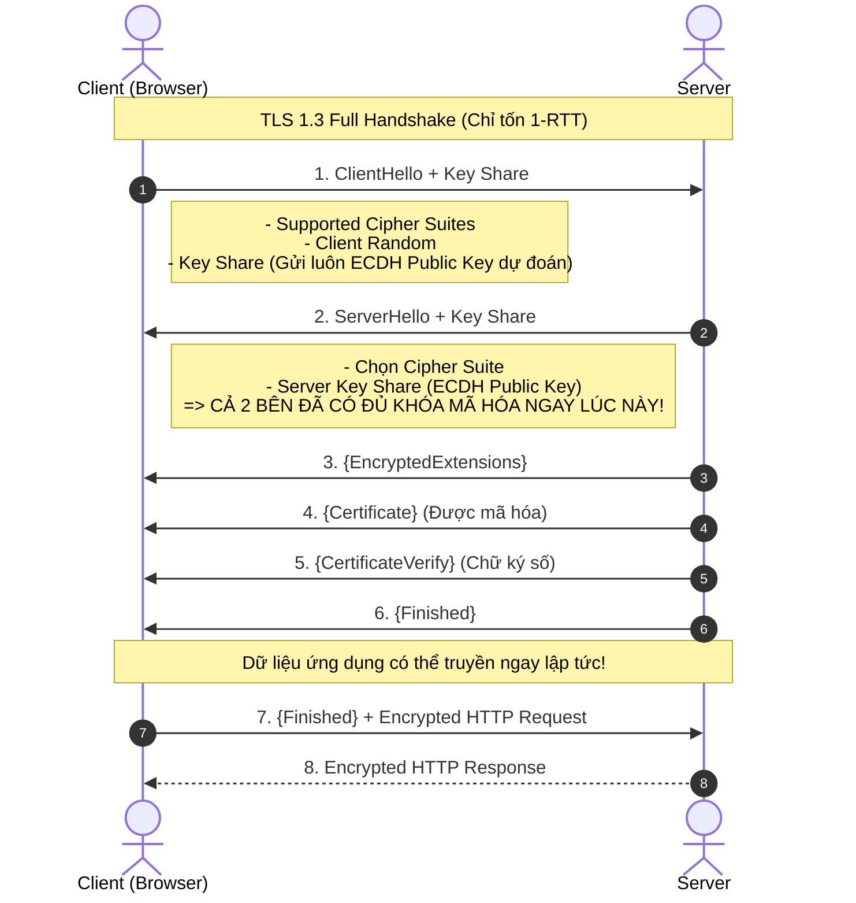

### Điểm khác biệt mang tính cách mạng của TLS 1.3:
1. **Giảm độ trễ từ 2-RTT xuống 1-RTT:** Nhờ kỹ thuật **Key Share**, Client gửi luôn tham số Diffie-Hellman ngay trong bản tin `ClientHello`.
2. **Hỗ trợ 0-RTT Resumption (Early Data):** Với các client đã từng kết nối trước đó, Client có thể gửi dữ liệu ứng dụng mã hóa ngay trong gói tin đầu tiên (tuy nhiên cần cẩn trọng với tấn công Replay Attack).
3. **Loại bỏ hoàn toàn các thuật toán mật mã lỗi thời/không an toàn:**
   * Cấm trao đổi khóa bằng RSA thuần túy (bắt buộc dùng ECDHE để đảm bảo **PFS - Perfect Forward Secrecy**: lộ Server Private Key trong tương lai cũng không giải mã được dữ liệu đã lưu trong quá khứ).
   * Loại bỏ cơ chế mã hóa CBC, dòng mã hóa RC4, hàm băm SHA-1, MD5. Chỉ giữ lại các chuẩn **AEAD (Authenticated Encryption with Associated Data)** hiện đại như `AES-GCM`, `AES-CCM`, `CHACHA20-POLY1305`.
4. **Mã hóa phần lớn Handshake:** Chứng chỉ của Server (`Certificate`) trong TLS 1.3 được mã hóa hoàn toàn, ngăn chặn kẻ nghe lén trên đường truyền biết được client đang truy cập chứng chỉ của ai.

---

# 5. Tiến Hóa Của Giao Thức Web: So Sánh HTTP/1.0, HTTP/1.1 và HTTP/2

*(Chuyên đề lấy cảm hứng từ phong cách phân tích kỹ thuật chuyên sâu của tạp chí công nghệ Grokking Vietnam)*

Giao thức HTTP (Hypertext Transfer Protocol) đã trải qua nhiều thập kỷ tiến hóa để giải quyết bài toán hiệu năng ngày càng khắt khe của thế giới Web.

---

## 5.1 HTTP/1.0: Khởi nguyên & Giới hạn Short-lived Connection

Trong kỷ nguyên HTTP/1.0 (RFC 1945 - 1996):
* **Cơ chế:** Mỗi cặp HTTP Request/Response đòi hỏi phải mở một kết nối TCP riêng biệt và đóng lại ngay khi nhận xong phản hồi (**Short-lived / Non-persistent Connection**).
* **Vấn đề nghiêm trọng:**
  * Giả sử một trang web có 1 file HTML, 10 file ảnh, 2 file CSS, 3 file JS (tổng 16 tài nguyên). Trình duyệt phải thực hiện **16 lần TCP 3-Way Handshake + 16 lần TCP Teardown**.
  * Chịu ảnh hưởng nặng nề bởi cơ chế **TCP Slow Start** ở mỗi kết nối mới, khiến băng thông mạng không bao giờ được tận dụng tối đa.

```text
[HTTP/1.0]
Client --- SYN ---> Server
Client <-- SYN-ACK- Server
Client --- ACK ---> Server
Client --- GET /image1.png ---> Server
Client <-- 200 OK (Data) ------ Server
Client --- FIN/ACK (Close) ---> Server
(Lặp lại quy trình trên cho TỪNG tài nguyên tiếp theo!)
```

---

## 5.2 HTTP/1.1: Persistent Connection, Pipelining & Head-of-Line Blocking

Ra mắt trong RFC 2616 (1999) và chuẩn hóa lại tại RFC 7230:

### 1. Persistent Connection (Keep-Alive)
* Mặc định cờ `Connection: keep-alive` được kích hoạt. Một kết nối TCP được giữ mở để tái sử dụng cho nhiều HTTP requests kế tiếp nhau, loại bỏ chi phí bắt tay lặp lại.

### 2. HTTP Pipelining (Giải pháp nửa vời)
* Cho phép Client gửi liên tiếp các Request 2, 3 mà không cần chờ Response 1 hoàn tất.
* **Tử huyệt của Pipelining:** Tiêu chuẩn quy định Server **bắt buộc phải trả về Response theo đúng thứ tự của Request đã nhận**. Nếu Request 1 xử lý một query DB mất 5 giây, thì dù Request 2 và 3 chỉ mất 1ms để xong, chúng vẫn phải nằm chờ Request 1 trả về xong xuôi.
* Đây chính là hiện tượng **HTTP Head-of-Line (HoL) Blocking ở Application Layer**. Do tiềm ẩn nhiều lỗi triển khai từ các Router trung gian (Proxy/Buggy middleware), tính năng này hầu như bị vô hiệu hóa mặc định trên tất cả các trình duyệt hiện đại.

### 3. Các kỹ thuật "Hack hiệu năng" thời kỳ HTTP/1.1:
Để lách qua giới hạn HoL Blocking và giới hạn tối đa 6 TCP connections/domain của trình duyệt, các kỹ sư Web đã phải sáng tạo ra nhiều "workarounds":
* **Domain Sharding:** Chia tài nguyên tĩnh sang nhiều domain con (`static1.example.com`, `static2.example.com`) để mở được nhiều kết nối TCP song song hơn.
* **Sprite Sheets (Image Spriting):** Ghép hàng trăm icon nhỏ vào 1 tấm ảnh lớn duy nhất để chỉ tải 1 request, sau đó dùng CSS background position cắt ra.
* **File Bundling & Inlining:** Gộp tất cả file JS/CSS thành 1 file khổng lồ (`bundle.js`, `styles.css`), hoặc nhúng trực tiếp chuỗi Base64 ảnh vào HTML.

---

## 5.3 HTTP/2: Binary Framing, Multiplexing, HPACK & Server Push

Được IETF phê duyệt năm 2015 (RFC 7540) dựa trên nền tảng giao thức thực nghiệm **SPDY** của Google, HTTP/2 thay đổi hoàn toàn cách dữ liệu được định dạng và truyền tải.

```text
HTTP/1.1 Interface (Plain Text Headers + Body)
                      |
                      v
+-------------------------------------------------------------+
|               HTTP/2 BINARY FRAMING LAYER                  |
|  [Frame Header: Length (24b) | Type (8b) | Flags | StreamID]|
|  +---------------------------+---------------------------+  |
|  | HEADERS Frame (Stream 1)  | DATA Frame (Stream 1)     |  |
|  +---------------------------+---------------------------+  |
|  | HEADERS Frame (Stream 3)  | DATA Frame (Stream 3)     |  |
+-------------------------------------------------------------+
                      |
                      v
                 Single TCP Connection
```

### 1. Binary Framing Layer (Lớp đóng gói nhị phân)
* Thay vì truyền các dòng văn bản ASCII thuần (Text-based) phân tách bởi ký tự xuống dòng `\r\n` dễ gây lỗi cú pháp, HTTP/2 phân tách thông điệp thành các **Frames nhị phân** nhỏ gọn.
* Cấu trúc một Frame gồm:
  * **Length (24 bits):** Độ dài frame.
  * **Type (8 bits):** Loại frame (ví dụ: `0x0` = DATA, `0x1` = HEADERS, `0x3` = RST_STREAM, `0x4` = SETTINGS, `0x8` = WINDOW_UPDATE).
  * **Flags (8 bits):** Các cờ điều khiển (như `END_STREAM`, `END_HEADERS`).
  * **Stream Identifier (31 bits):** ID luồng mà frame này trực thuộc.

### 2. Multiplexing (Ghép kênh trên 1 kết nối duy nhất)
* Cho phép lồng ghép (Interleave) nhiều Streams độc lập (cả Request và Response) trên **DUY NHẤT 1 kết nối TCP**.
* Các Frame của Stream 1, Stream 3, Stream 5 có thể gửi xen kẽ lẫn nhau mà không hề gây nghẽn. Bên nhận sẽ căn cứ vào `Stream ID` để ráp nối lại chính xác từng thông điệp.
* **Chấm dứt hoàn toàn HTTP Head-of-Line Blocking!**

### 3. Nén Header HPACK (RFC 7541)
* Trong HTTP/1.1, các headers trùng lặp khổng lồ như `User-Agent`, `Cookie`, `Authorization` bị gửi đi gửi lại trong từng request gây lãng phí băng thông nghiêm trọng.
* HPACK giải quyết bằng cách:
  * **Static Table:** Bảng cố định 61 trường header thông dụng nhất (ví dụ index `2` = `GET /`, index `7` = `:scheme: https`).
  * **Dynamic Table:** Bảng động lưu lại các header đã gửi giữa 2 bên trong suốt phiên kết nối. Lần sau gửi chỉ cần truyền chỉ số Index.
  * **Huffman Coding:** Nén chuỗi ký tự theo bảng mã tần suất.

### 4. Server Push & Stream Prioritization
* **Server Push:** Khi client yêu cầu `index.html`, Server biết chắc client sẽ cần `style.css` và `app.js`. Server có thể chủ động "bắn" trước các file này về cache của client qua cờ `PUSH_PROMISE` trước khi client kịp gửi request hỏi.
* **Stream Prioritization:** Gán trọng số (Weight từ 1 đến 256) và sự phụ thuộc (Dependency) để ưu tiên tải các tài nguyên render quan trọng trước.

---

## 5.4 Sơ đồ so sánh trực quan cơ chế truyền tải dữ liệu

Dưới đây là sơ đồ so sánh trực quan minh họa cách tải 3 tài nguyên (`index.html`, `style.css`, `app.js`) giữa các thế hệ HTTP:

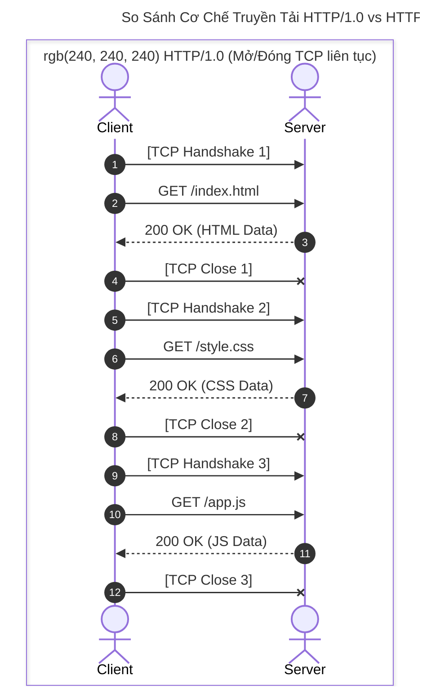

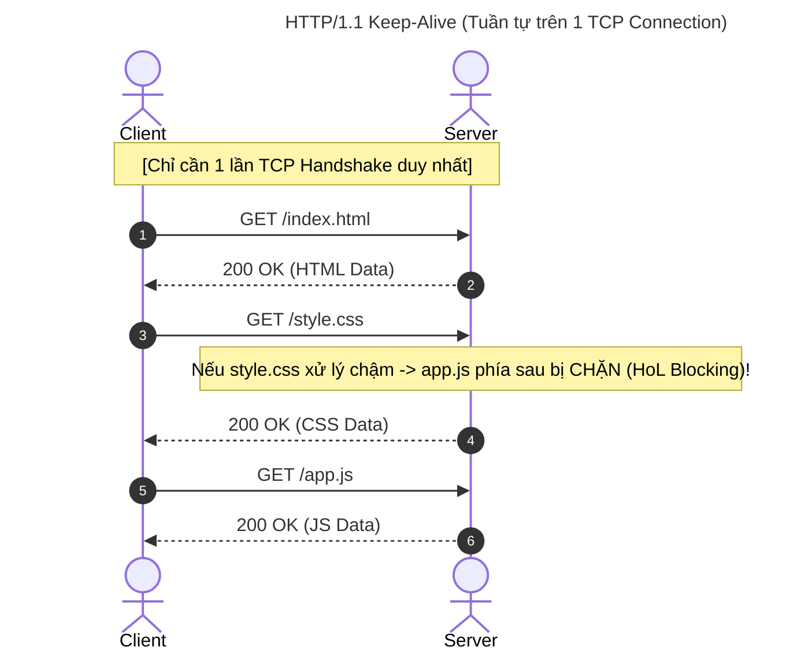

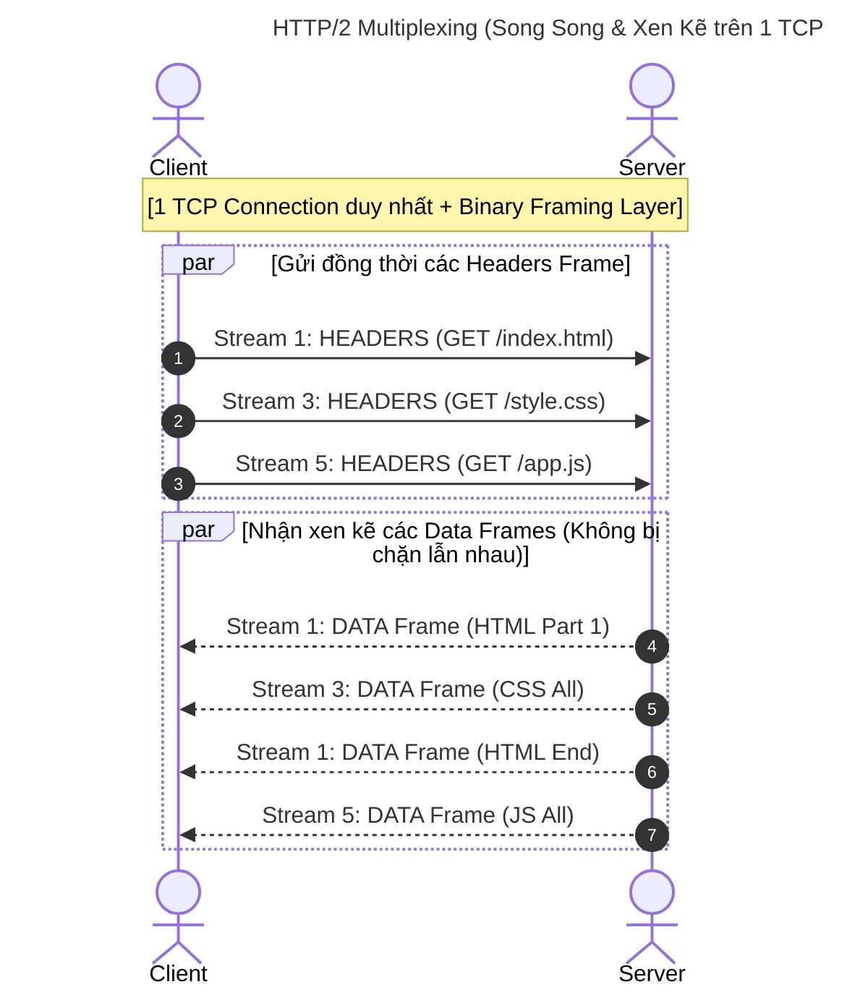

---

## 5.5 Nhìn nhanh về HTTP/3 (QUIC) & Bảng so sánh tổng hợp

> [!NOTE]
> **Vấn đề còn lại của HTTP/2: TCP Head-of-Line Blocking**
> Mặc dù HTTP/2 giải quyết triệt để HoL Blocking ở tầng ứng dụng, nhưng vì vẫn chạy trên **TCP**, nếu một gói tin TCP bị rớt trên đường truyền (packet loss), toàn bộ kết nối TCP bị khựng lại để chờ retransmission, khiến tất cả các stream HTTP/2 khác đều bị nghẽn theo.
> **HTTP/3** ra đời (RFC 9114) chuyển sang chạy trên nền **QUIC (dựa trên UDP)**, biến từng Stream thành các luồng độc lập thực sự ở tầng Transport!

### Bảng so sánh tổng hợp chi tiết

| Tiêu chí | HTTP/1.0 | HTTP/1.1 | HTTP/2 | HTTP/3 |
| :--- | :--- | :--- | :--- | :--- |
| **Giao thức nền (Transport)** | TCP | TCP | TCP | **QUIC (UDP)** |
| **Định dạng dữ liệu** | Plain Text | Plain Text | **Binary Frames** | **Binary Frames** |
| **Quản lý kết nối** | Mở/đóng cho từng request | Persistent (Keep-Alive mặc định) | Multiplexing trên 1 TCP Connection | Multiplexing trên QUIC Streams |
| **Ghép kênh (Multiplexing)** | ❌ Không | ⚠️ Pipelining (Lỗi thời/Kém) | ✅ Hoàn hảo trên Application | ✅ Hoàn hảo cả Application & Transport |
| **Head-of-Line Blocking** | Nặng nề | Nặng nề (App Layer) | ❌ Hết ở App Layer (Vẫn còn ở TCP) | ❌ Loại bỏ hoàn toàn 100% |
| **Nén Header** | ❌ Không | ❌ Không | ✅ **HPACK** | ✅ **QPACK** |
| **Server Push** | ❌ Không | ❌ Không | ✅ Có | ✅ Có |
| **Chi phí Handshake** | TCP (1 RTT) + TLS (2 RTT) | TCP (1 RTT) + TLS (2 RTT) | TCP (1 RTT) + TLS (1-2 RTT) | **1 RTT / 0 RTT (Gộp cả Transport + TLS 1.3)** |

---

# 6. Cẩm Nang Bắt Và Phân Tích Gói Tin Bằng Wireshark

Wireshark là công cụ giám sát và mổ xẻ gói tin mạng (Packet Sniffer & Protocol Analyzer) chuẩn công nghiệp.

---

## 6.1 Danh sách Wireshark Display Filters thông dụng

Khi phân tích các giao thức đã học ở trên, sử dụng các bộ lọc hiển thị (Display Filters) dưới đây:

### 1. Phân tích TCP Flags & Kết nối
```wireshark
# Lọc gói tin khởi tạo kết nối (Chỉ có cờ SYN được bật)
tcp.flags.syn == 1 && tcp.flags.ack == 0

# Lọc gói tin phản hồi bắt tay bước 2 (Cả SYN và ACK cùng bật)
tcp.flags.syn == 1 && tcp.flags.ack == 1

# Lọc gói tin giải phóng kết nối (Cờ FIN bật)
tcp.flags.fin == 1

# Lọc các gói tin bị ngắt đột ngột (Cờ RST bật)
tcp.flags.reset == 1

# Lọc gói tin theo cổng cụ thể
tcp.port == 443 || tcp.port == 80

# Lọc các gói tin TCP bị lỗi/phát hiện mất gói cần truyền lại (TCP Retransmission)
tcp.analysis.retransmission || tcp.analysis.duplicate_ack
```

### 2. Phân tích DNS Query & Response
```wireshark
# Lọc toàn bộ lưu lượng DNS
dns

# Chỉ lọc gói tin truy vấn DNS (Query)
dns.flags.response == 0

# Chỉ lọc gói tin phản hồi DNS (Response)
dns.flags.response == 1

# Tìm kiếm truy vấn tên miền cụ thể
dns.qry.name contains "example.com"

# Lọc bản ghi DNS trả về mã lỗi không tìm thấy tên miền (NXDOMAIN)
dns.flags.rcode == 3
```

### 3. Phân tích TLS / SSL Handshake
```wireshark
# Lọc toàn bộ bản tin TLS
tls

# Lọc bản tin ClientHello
tls.handshake.type == 1

# Lọc bản tin ServerHello
tls.handshake.type == 2

# Lọc bản tin Server Certificate
tls.handshake.type == 11

# Lọc theo Server Name Indication (SNI) - Tên domain mà client muốn truy cập
tls.handshake.extensions_server_name contains "example.com"
```

### 4. Phân tích HTTP/1.1 & HTTP/2
```wireshark
# Lọc HTTP/1.1 Requests
http.request

# Lọc theo HTTP Method
http.request.method == "GET" || http.request.method == "POST"

# Lọc theo mã phản hồi HTTP Response Status Code
http.response.code >= 400

# Lọc toàn bộ luồng dữ liệu HTTP/2
http2

# Lọc các Frame loại HEADERS trong HTTP/2
http2.type == 1

# Lọc các Frame loại DATA trong HTTP/2
http2.type == 0

# Lọc Stream ID cụ thể trong HTTP/2
http2.streamid == 1
```

---

## 6.2 Phân tích mẫu một phiên làm việc thực tế trên Wireshark

Dưới đây là trích xuất cấu trúc phân cấp (Packet Tree) thực tế khi bắt một phiên truy cập HTTPS trên Wireshark:

```text
================================================================================
GÓI TIN SỐ 14: TCP 3-Way Handshake (Client -> Server)
================================================================================
Frame 14: 66 bytes on wire (528 bits), 66 bytes captured
Ethernet II, Src: Intel_3a:5f:12 (00:1a:2b:3a:5f:12), Dst: Router_01:aa:bb (c8:d7:19:01:aa:bb)
Internet Protocol Version 4, Src: 192.168.1.15, Dst: 93.184.216.34
Transmission Control Protocol, Src Port: 54321, Dst Port: 443, Seq: 0, Len: 0
    Source Port: 54321
    Destination Port: 443
    [Sequence Number: 0    (relative sequence number)]
    [Acknowledgment Number: 0]
    Header Length: 32 bytes (8)
    Flags: 0x002 (SYN)
        0000 0000 0010 = Set: SYN (1)
    Window: 64240
    Checksum: 0x7a3f [validation disabled]
    Options: (12 bytes) - MSS 1460, SACK permitted, WS 128

================================================================================
GÓI TIN SỐ 18: TLS 1.3 ClientHello
================================================================================
Transport Layer Security
    TLSv1.3 Record Layer: Handshake Protocol: Client Hello
        Content Type: Handshake (22)
        Version: TLS 1.0 (0x0301)  <-- Tương thích ngược
        Length: 512
        Handshake Protocol: Client Hello
            Handshake Type: Client Hello (1)
            Length: 508
            Version: TLS 1.2 (0x0303)
            Random: 7b3f91a2c894e5f6... (32 bytes)
            Session ID: 5a8d9f12...
            Cipher Suites (17 suites)
                Cipher Suite: TLS_AES_128_GCM_SHA256 (0x1301)
                Cipher Suite: TLS_AES_256_GCM_SHA384 (0x1302)
                Cipher Suite: TLS_CHACHA20_POLY1305_SHA256 (0x1303)
            Extension: server_name (len=20) -> api.example.com
            Extension: supported_versions (len=9) -> TLS 1.3, TLS 1.2
            Extension: key_share (len=107) -> Khóa công khai ECDH
```

---

## 💡 Mẹo Debug Hiệu Năng & Network Troubleshooting
1. **Kiểm tra RTT (Round Trip Time):** Trong Wireshark, chọn `Statistics` -> `TCP Stream Graphs` -> `Round Trip Time Graph` để xem biến thiên độ trễ kết nối.
2. **Kiểm tra Packet Loss:** Lọc `tcp.analysis.flags` để phát hiện ngay các đoạn mạng bị chập chờn, mất gói hoặc nhận duplicate ACK liên tục.
3. **Giải mã gói tin HTTPS:** Bạn có thể thiết lập biến môi trường `SSLKEYLOGFILE=C:\ssl_keys.log` trong Windows, sau đó cấu hình Wireshark (`Edit` -> `Preferences` -> `Protocols` -> `TLS` -> `(Pre)-Master-Secret log filename`) để Wireshark giải mã trực tiếp toàn bộ nội dung HTTP/1.1 và HTTP/2 bên trong đường hầm HTTPS!

---

*Tài liệu được tổng hợp và chuẩn hóa theo các tiêu chuẩn RFC chính thức của IETF và kinh nghiệm thực chiến từ Grokking Vietnam.*
